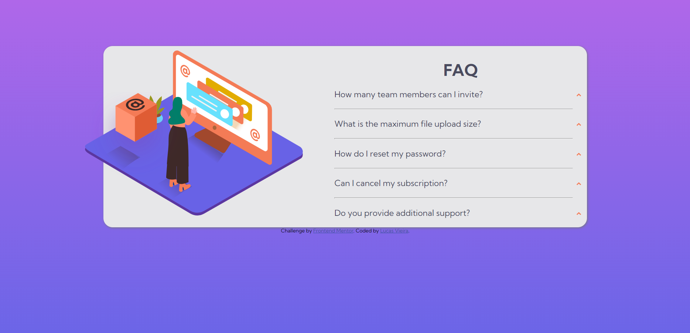

# Frontend Mentor - FAQ accordion card solution

This is a solution to the [FAQ accordion card challenge on Frontend Mentor](https://www.frontendmentor.io/challenges/faq-accordion-card-XlyjD0Oam). Frontend Mentor challenges help you improve your coding skills by building realistic projects. 

## Table of contents

- [Overview](#overview)
  - [The challenge](#the-challenge)
  - [Screenshot](#screenshot)
  - [Links](#links)
- [My process](#my-process)
  - [Built with](#built-with)
  - [What I learned](#what-i-learned)
  - [Continued development](#continued-development)
- [Author](#author)
- [Acknowledgments](#acknowledgments)


## Overview

### The challenge

Users should be able to:

- View the optimal layout for the component depending on their device's screen size
- See hover states for all interactive elements on the page
- Hide/Show the answer to a question when the question is clicked

### Screenshot



### Links

- Solution URL: [Add solution URL here](https://your-solution-url.com)
- Live Site URL: [Add live site URL here](https://your-live-site-url.com)

## My process

### Built with

- Semantic HTML5 markup
- CSS custom properties
- Flexbox
- CSS Grid
- Mobile-first workflow
- JS Vanilla

### What I learned

This was my first Javascript project, and i learn so much about events, node list to array and DOM manipulation. Took me a while to discover how to toogle the question, and i try so many methods, and the more simple work it, so i'm pretty happy with it. The way i acomplished to do it was by a direct event in the html file, kinda arcaic but it works.
```
    <div onclick='function(indexof)'>

Example:
    <div onclick='toggle(0)'>

```

### Continued development

I imagine that are very easier ways to do this task, so i want to learn more about DOM manipulation, and better practices to it, advices and tips are welcome.


## Author

- Frontend Mentor - [@JimCarey08](https://www.frontendmentor.io/profile/JimCarey08)
- Twitter - [@LucasViCoisas](https://www.twitter.com/LucasViCoisas)

## Acknowledgments

Even when you don't have any ideia on how to do something, don't give up, put aside, go do other thing, but when you even realize, you will come with an ideia, then stop waht your doing and go try it. If doesn't work, repeat. 
